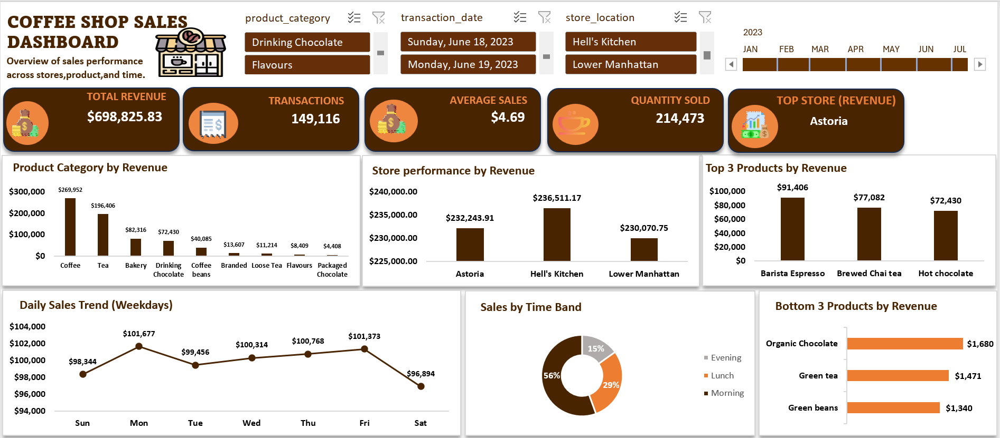

# Coffee-shop-data

### Dataset Overview 
Coffee Shop Sales Dashboard – An interactive dashboard tracking sales performance across stores, products, and time. Features KPI (revenue, transactions, avg. sale), product/store comparisons, weekday sales trends, and time-band analysis, with slicers for dynamic filtering by category, date, and location.

☕ Coffee Shop Sales Analysis Dashboard
📌 Project Overview

This project analyzes Coffee Shop sales data to uncover valuable business insights related to revenue, product performance, store performance, sales trends, and customer purchasing patterns.

The project was developed using Microsoft Excel, where the data was cleaned, analyzed using Pivot Tables, and transformed into an interactive dashboard using Pivot Charts, KPI cards, Slicers, and Timeline filters.

The goal was to transform raw transaction data into meaningful insights that can support better business decisions.

🎯 Project Objectives

The analysis was conducted to answer the following business questions:

What is the total revenue generated?
How many transactions were completed?
What is the average sales value?
Which store generates the highest revenue?
Which product categories generate the most revenue?
What are the top 3 and bottom 3 products by revenue?
How does sales performance vary across the days of the week?
Which time period generates the highest sales?
🛠️ Tools Used
Microsoft Excel
Data Cleaning and Preparation
Pivot Tables
Pivot Charts
Slicers
Timeline Filters
KPI Cards
Data Visualization
📂 Dataset

The dataset contains detailed Coffee Shop transaction records across different store locations, products, dates, and time periods.

Key columns include:

Transaction ID
Transaction Date
Transaction Time
Store Location
Product Category
Product Type
Product Detail
Quantity
Unit Price
Sales
Day of the Week
Month
Time Band
📸 Cleaned Dataset

The dataset was cleaned and prepared before performing the analysis and creating the dashboard.

📌 Add your cleaned dataset screenshot here.

🧹 Data Cleaning and Preparation

Before beginning the analysis, the dataset was reviewed and prepared to ensure it was suitable for reporting and visualization.

The data preparation process included:

Reviewing the dataset structure
Checking data consistency
Formatting date and time columns
Ensuring numerical fields were properly formatted
Preparing the dataset for Pivot Table analysis
Creating fields required for time-based analysis

The cleaned dataset was then used as the foundation for the Pivot Tables and interactive dashboard.

📊 Data Analysis

Pivot Tables were used to summarize and analyze the Coffee Shop sales data.

The analysis focused on:

Revenue by Product Category
Revenue by Store Location
Top 3 Products by Revenue
Bottom 3 Products by Revenue
Daily Sales Trends
Sales Performance by Time Band

The Pivot Table sheet served as the analysis workspace and provided the foundation for building the final dashboard.

📈 Interactive Dashboard

The final stage of the project involved creating an interactive Coffee Shop Sales Dashboard.

The dashboard provides a clear overview of sales performance and allows users to interact with the data using Slicers and Timeline filters.

📸 Dashboard Preview

📊 Key Performance Indicators

The dashboard highlights the following KPIs:

KPI	Result
💰 Total Revenue	$698,825.83
🧾 Total Transactions	149,116
📈 Average Sales	$4.69
☕ Quantity Sold	214,473
🏆 Top Store	Astoria
🔍 Key Insights
☕ Product Category Performance
Coffee generated the highest revenue at approximately $269,952.
Tea was the second-highest revenue-generating category at approximately $196,406.
Bakery and Drinking Chocolate also made significant contributions to total revenue.
Flavours and Packaged Chocolate generated the lowest revenue among the product categories.
🏪 Store Performance

The three store locations generated relatively similar revenue:

🥇 Hell's Kitchen: $236,511.17
🥈 Astoria: $232,243.91
🥉 Lower Manhattan: $230,070.75

Hell's Kitchen was the highest-performing store by revenue.

🏆 Top 3 Products by Revenue
Barista Espresso — $91,406
Brewed Chai Tea — $77,082
Hot Chocolate — $72,430
📉 Bottom 3 Products by Revenue
Organic Chocolate — approximately $1,680
Green Tea — approximately $1,471
Green Beans — approximately $1,340

These products may require further investigation to understand their lower sales performance.

📅 Daily Sales Trend

Sales remained relatively stable across the days of the week, with some noticeable variations.

Monday and Friday recorded some of the strongest sales performance, while Saturday showed comparatively lower sales.

⏰ Sales by Time Band

The Morning period generated the highest percentage of sales, accounting for approximately 56% of total sales.

Lunch contributed approximately 29%, while Evening contributed approximately 15%.

This indicates that the Morning period is the most important sales period for the Coffee Shop.

🎛️ Interactive Features

The dashboard includes interactive filters that allow users to explore the data dynamically.

Users can filter the dashboard by:

Product Category
Transaction Date
Store Location
Month

These features make it easier to analyze specific areas of the business and explore sales performance across different segments.

💡 Business Recommendations

Based on the analysis, the following recommendations can be considered:

1️⃣ Focus on High-Performing Products

Continue promoting high-performing products such as Barista Espresso, Brewed Chai Tea, and Hot Chocolate to maximize revenue opportunities.

2️⃣ Review Low-Performing Products

Investigate why products such as Organic Chocolate, Green Tea, and Green Beans generate lower revenue. Management could consider improving promotions, pricing, or product placement.

3️⃣ Optimize Staffing During Peak Hours

Since the Morning period generates the majority of sales, adequate staff should be scheduled during this period to improve customer service and operational efficiency.

4️⃣ Apply Best Practices Across Stores

Hell's Kitchen generated the highest revenue. Management can analyze its successful practices and apply relevant strategies to other store locations.

5️⃣ Use Sales Trends for Business Planning

Daily and time-based sales trends can support better decisions regarding:

Staff scheduling
Inventory planning
Promotional campaigns
Store operations
📁 Project Structure
Coffee-Shop-Sales-Analysis/
│
├── Coffee Shop data.xlsx
│
├── README.md
│
└── images/
    ├── cleaneddataset.png
    └── coffeeshopdashboard.png
📌 Conclusion

This project demonstrates my ability to transform raw business data into meaningful insights using Microsoft Excel.

Through data cleaning, Pivot Table analysis, data visualization, and dashboard development, I was able to analyze Coffee Shop sales performance and identify key trends across products, store locations, days, and time periods.

The interactive dashboard makes it easier for stakeholders to monitor performance and make data-driven business decisions.

👤 Author

James Asuku John

📊 Data Analyst
💻 Excel | SQL | Power BI
📈 Turning Data into Actionable Insights

